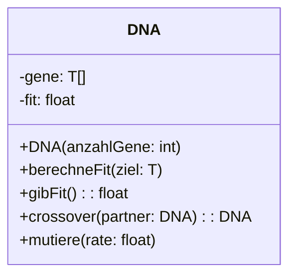

# Die Klasse DNA

Die Desoxyribonukleinsäure, meist kurz als DNA bezeichnet, trägt Erbinformation bei allen Lebewesen und den DNA-Viren. Die DNA besteht aus verschiedenen Abschnitten - den Genen. Ein Gen stellt die Grundinformationen für die Entwicklung von Eigenschaften eines Individuums zu bereit. Beim sogenannten Crossover werden Gene ausgetauscht. Bei der Mutation werden Gene verändert.

## Das Klassendiagramm

Für die evolutionären Algorithmen benötigen wird die folgende Klasse.

:::alert{info}
Die eckigen Klammern [] repräsentieren unsere erste lineare Datenstruktur das Array. Ein Array ist nicht anderes als eine Sammlung von gleichartigen Daten mit festgelegter Größe.
:::

Das ist der Grundaufbau für unsere zwei Anwendungsfälle. Das T bezeichnet einen beliebigen Datentyp für die Gene. Dieser Datentyp T kann ein Integer, ein String oder eine eigene Klasse sein. Diesen müssen wir für jeden Anwendungsfall neu wählen.

### Aufgabe

Implementiere das Gerüst der Klasse DNA in BlueJ, das heißt, dass nur die Methodenköpfe implementiert werden müssen und keine Funktionalität. Verwende für T den Datentyp char.

## Eine Hilfsmehtode: Zufallsbuchstabe

Im UML-Klassendiagramm hat eine kleine Hilfsmethode gefehlt, die wir für die folgenden Aufgaben benötigen.

Die Methode `zufallsbuchstabe` soll einen char-Wert zwischen 127 und 32 erzeugen.

:::alert{info}
char-Werte stehen in Beziehung zu der ASCII-Tabelle. Die ASCII-Werte zwischen 32 und 127 sind alle druckbaren Zeichen. (Siehe: https://www.ascii-code.com)
:::

### Aufgabe

Implementiere die Methode `private char zufallsbuchstabe()`, sodass sie einen char-Wert zwischen 32 und 127 zurückgibt. Nutze dazu die Methode `Math.random()`. `Math.random()` gibt einen Double-Wert zwischen 0 und 1 zurück.

:::collapsible{title="Hilfe" id="590546"}

Der folgende Quelltext könnte dir helfen. Was tut er bloß?

`(char) (Math.random() * (max - min) + max)`

Teste den Quelltext mit verschiedenen max, min und Math.random() Werten. Zum Beispiel min = 3, max = 10, Math.random() = 0.2

:::

## Der Konstruktor

Im Konstruktor wollen wir die Attribute gene und fit initial belegen.

Ein Array initalisiert man mit einer speziellen Schreibweise: `int[] test = new int[10];`

Dabei ist `int[]` der Datentyp "Array von int-Werten". Der Ausdruck `new int[10]` reserviert einen Speicherbereich, in dem 10 int-Werte Platz haben und liefert eine Referenz darauf zurück. Nach der Zuweisung (=) zeigt die Variable test auf diesen Speicherbereich.

Die zehn Werte nennt man **Elemente**. Sie werden **mit den Indizes 0 bis 9** durchnummeriert.

Du kannst mit `test[3]` auf ein Element zugreifen und mit `test[2] = 29` einem Element einen neuen Wert zuweisen.

### Aufgabe

Implementiere den Konstruktor so, dass der Parameter `anzahlGene` für die Anzahl der Plätze des Arrays `gene` genutzt wird.

## Die Methode: Crossover

Die Methode Crossover soll das aktuelle DNA-Objekt und ein weiteres nehmen und ein neues Erstellen. Dabei eine Zufallszahl angeben wie viel von der ersten DNA und wie viel von der zweiten DNA genommen wird.

Der folgende Pseudocode zeigen den Algorithmus:

::struktog{data="https://struktog.openpatch.org/#pako:eNqVlN1q3UYQx19F6DaesN-za9pCmoYSCLkK9CL0Yj9mjoRlHaOjgxsHv00eI3d-sY5NEuPCcSNdiN3Ranb___nNfu4v942m_vxzP7b-vCdlcnXagzK1gfJaQ3Q2Q4zeO7bUn_XrpyuSlW_nAy3re_lbYryfpv31m4kuaV5_JMucguXgwcSI0ErKUNgjWKXRtxoek33Ih4tvqVb6RzL0b5YbOu6oo3GmbqYjdX-8f9Ud5yaTWUKHkbqLcW4nNw8cbfDogLgxcM4edHLyClU3q9smJQ5bUck00IY8RGoZOGkFRDar5vlnlczdzZHvvkzTuJPxh0WkXMve3c31eKiDhNSDxEZL92q-ycP0MPyT5tNH8zZobjpB1KzBoTidSyIIKhj0BjfpxKRCLVSglBwg6xYhNZ2hVdccBfuY7PX-OK_v9vurp2L57uvSjd2v34SM3S-dKKWXE827degux7UbX7x4Row1zgl0wSkLiTMCmuggB0JjQ94kplCU0nMBi6WCy5HAekYwSWkVbXmuaLuxPOAl9VruvtaL04xj0DHHAoEMQTGOoTjrgLHG1vAnMZuP03R7e3vW12Gc2o_kpmTUFq20n7Sk9FKEkFkBhlIr-W3daJRKwReE5H0CY4wHSgKKo0j4xNvflzzX4akhfwmqUs7fHqE9uVHKmY3FCljl6EbZAs3WBEyBVQ28wRJZuRzp9RNTaspy3krALlmoKIxUHRiaNrVg1ZtMSa6xM3InlewcpBKSsKYyEFKVS4KeY-Sej5f3dH8c_xbi12E8fJ-e3E8TMxrBMTdyUG3WkEzSIFEbMG7FhfN0-I893lUlJw_3GDKE0uQGTyqB18yeMG5rIaNQ6WrBkwrgVXCAMRswXkWNmTfYc5WXdablfx2yVYv5pYEt_p4eZ0HXlCD4EAI6vcmh789ZP9C4G-SDsfGsvx7bOvTnSfvbfwFM4Cuf"}

### Aufgabe

Überführe das Struktogramm in dein BlueJ-Projekt.