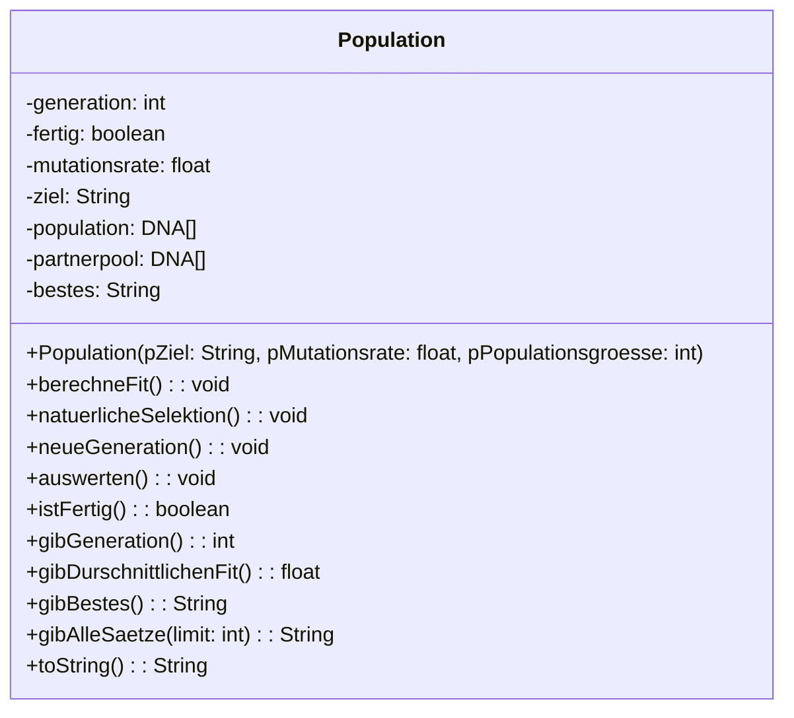

# Die Klasse Population

Eine Population repräsentiert eine Menge von Objekten, die eine DNA besitzen. Die Population kann sich mit der Zeit verändern, indem sie natürlich selektiert wird.




Das ist der Aufbau der Klasse Population für unseren Anwendungsfall. Im Laufe des Kapitels werden wir die Klasse implementieren und die einzelnen Methoden werden genauer erklärt.

### Aufgabe

Implementiere das Gerüst der Klasse Population, das heißt, dass nur die Methodenköpfe implementiert werden müssen und keine Funktionalität.

:::onlineide

```java Population.java
public class Population {

}
```

```java DNA.java
public class DNA {

  private char[] gene;
  private float fit;

  public DNA(int anzahlGene) {
    gene = new char[anzahlGene];
    for (int i = 0; i < gene.length; i++) {
      gene[i] = this.zufallsbuchstabe();
    }
  }

  public float gibFit() {
    return fit;
  }

  public char zufallsbuchstabe() {
    return (char) (Math.round(Math.random() * (127 - 32) + 32));
  }

  public void berechneFit(String ziel) {
    int score = 0;
    for (int i = 0; i < gene.length; i++) {
      if (gene[i] == ziel.charAt(i)) {
        score++;
      }
    }
    fit = (float) score / (float) ziel.length();
  }


  public DNA crossover(DNA partner) {
    DNA kind = new DNA(gene.length);

    int trennwert = (int) (Math.random() * gene.length);

    for (int i = 0; i < gene.length; i++) {
        if (i > trennwert) {
            kind.gene[i] = this.gene[i];
        } else {
            kind.gene[i] = partner.gene[i];
        }
    }

    return kind;
  }

  public void mutiere(float mutationsrate) {
    for (int i = 0; i < gene.length; i++) {
        if (Math.random() < mutationsrate) {
            gene[i] = this.zufallsbuchstabe();
        }
    }
  }

  public String toString() {
    return String.valueOf(this.gene);
  }
}
```

:::

# Der Konstruktor und toString

Der Konstruktor der Klasse Population ist fast vollständig implementiert.

## Aufgabe

1. Ergänze die Lücken ###.
2. Erzeuge ein Objekt der Klasse Population im Abschnitt TESTEN.
3. Implementiere die Methode `toString`, sodass für jedes Element des Arrays `population` die Methode `toString` aufgerufen wird und diese Werte in der Variablen `alle` gespeichert werden.
4. Rufe die Methode `toString` auf dem Populationsobjekt auf.

:::onlineide

```java Population.java

// TESTEN


// TESTEN

public class Population {
    private int generationen;
    private boolean fertig;
    private float mutationsrate;
    private String ziel;
    private DNA[] population;
    private DNA[] partnerpool;
    private String bestes;

    public Population(String pZiel, float pMutationsrate, int pPopulationsgroesse) {
        this.population = new DNA[#####];
        this.mutationsrate = pMutationsrate;
        this.ziel = pZiel;
        this.bestes = "";
        this.generationen = 0;
        this.fertig = false;

        for (int i = 0; i < ####; i++) {
            this.population[####] = new DNA(pZiel.length());
        }
    }

    public String toString() {
        String alle = "";

        return alle;
    }
}
```

```java DNA.java
public class DNA {

  private char[] gene;
  private float fit;

  public DNA(int anzahlGene) {
    gene = new char[anzahlGene];
    for (int i = 0; i < gene.length; i++) {
      gene[i] = this.zufallsbuchstabe();
    }
  }

  public float gibFit() {
    return fit;
  }

  public char zufallsbuchstabe() {
    return (char) (Math.round(Math.random() * (127 - 32) + 32));
  }

  public void berechneFit(String ziel) {
    int score = 0;
    for (int i = 0; i < gene.length; i++) {
      if (gene[i] == ziel.charAt(i)) {
        score++;
      }
    }
    fit = (float) score / (float) ziel.length();
  }


  public DNA crossover(DNA partner) {
    DNA kind = new DNA(gene.length);

    int trennwert = (int) (Math.random() * gene.length);

    for (int i = 0; i < gene.length; i++) {
        if (i > trennwert) {
            kind.gene[i] = this.gene[i];
        } else {
            kind.gene[i] = partner.gene[i];
        }
    }

    return kind;
  }

  public void mutiere(float mutationsrate) {
    for (int i = 0; i < gene.length; i++) {
        if (Math.random() < mutationsrate) {
            gene[i] = this.zufallsbuchstabe();
        }
    }
  }

  public String toString() {
    return String.valueOf(this.gene);
  }
}
```

:::